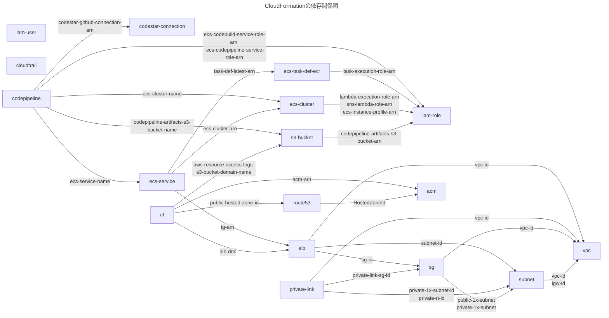

```mermaid
---
title: CloudFormationの依存関係図
---

flowchart LR

  iam-user
  iam-role
  cloudtrail
  codestar-connection
  s3-bucket

  vpc
  subnet
  sg

  alb
  cf

  ecs-cluster
  ecs-task-def-ecr

  s3-bucket -- codepipeline-artifacts-s3-bucket-arn --> iam-role

  subnet -- vpc-id \n igw-id --> vpc
  sg -- vpc-id --> vpc
  sg -- public-1x-subnet \n private-1x-subnet --> subnet
  private-link -- vpc-id --> vpc
  private-link -- "private-1x-subnet-id \n private-rt-id" --> subnet
  private-link -- "private-link-sg-id" --> sg

  route53 -- HostedZoneId --> acm

  alb -- vpc-id --> vpc
  alb -- subnet-id --> subnet
  alb -- sg-id --> sg

  cf -- acm-arn --> acm
  cf -- aws-resource-access-logs-s3-bucket-domain-name --> s3-bucket
  cf -- alb-dns --> alb
  cf -- public-hosted-zone-id --> route53

  ecs-cluster -- lambda-execution-role-arn \n sns-lambda-role-arn \n ecs-instance-profile-arn --> iam-role
  ecs-task-def-ecr -- task-execution-role-arn --> iam-role

  ecs-service -- ecs-cluster-arn --> ecs-cluster
  ecs-service -- tg-arn --> alb
  ecs-service -- task-def-latest-arn --> ecs-task-def-ecr

  codepipeline -- ecs-codebuild-service-role-arn \n ecs-codepipeline-service-role-arn --> iam-role
  codepipeline -- codepipeline-artifacts-s3-bucket-name --> s3-bucket
  codepipeline -- ecs-cluster-name --> ecs-cluster
  codepipeline -- ecs-service-name --> ecs-service
  codepipeline -- codestar-github-connection-arn --> codestar-connection
```
